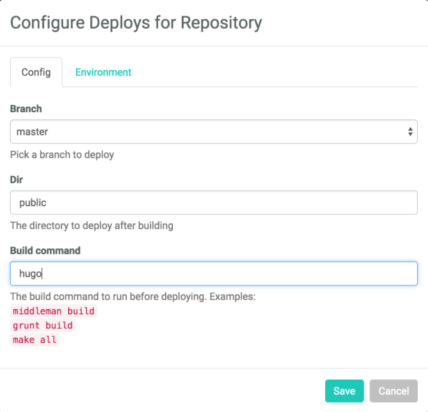

## 로컬에 휴고 사이트 설치 및 실행

### 설치

1. `homebrew`로 hugo 설치.

   ```bash
     brew install hugo
   ```

2. hugo로 사이트 생성.

   ```bash
     hugo new site <Site-Name>
   ```

3. 생성된 사이트에 들어가서 theme 설치. 내 경우는 LoveIt theme를 적용하였다.

   ```bash
     cd <Site-Name>

     git clone https://github.com/dillonzq/LoveIt.git themes/LoveIt
   ```

4. `config.toml` 파일 수정하기

   ```toml
     baseURL = "http://example.org/"

     # [en, zh-cn, fr, ...] determines default content language

     defaultContentLanguage = "en"

     # language code

     languageCode = "en"
     title = "My New Hugo Site"

     # Change the default theme to be use when building the site with Hugo

     theme = "LoveIt"

     [params]

     # LoveIt theme version

     version = "0.2.X"

     [menu]
     [[menu.main]]
     identifier = "posts" # you can add extra information before the name (HTML format is supported), such as icons
     pre = "" # you can add extra information after the name (HTML format is supported), such as icons
     post = ""
     name = "Posts"
     url = "/posts/" # title will be shown when you hover on this menu link
     title = ""
     weight = 1
     [[menu.main]]
     identifier = "tags"
     pre = ""
     post = ""
     name = "Tags"
     url = "/tags/"
     title = ""
     weight = 2
     [[menu.main]]
     identifier = "categories"
     pre = ""
     post = ""
     name = "Categories"
     url = "/categories/"
     title = ""
     weight = 3

     # Markup related configuration in Hugo

     [markup]

     # Syntax Highlighting (https://gohugo.io/content-management/syntax-highlighting)

     [markup.highlight] # false is a necessary configuration (https://github.com/dillonzq/LoveIt/issues/158)
     noClasses = false
   ```

### 첫 포스트 발행

```bash
  hugo new posts/first-post.md
```

처음 생성하면 `content/posts/` 경로에 `first-post.md`파일이 생성된다.

`draft=true`로 지정되어 있을텐데 개발 모드에서 실행하면서 확인하기 위해 `false`로 변경해주자.

그리고 본문 내용이 있어야하므로 `hello hugo`라고 입력해 준 다음 저장한다.

### 실행

1. 로컬 `localhost:1313`에서 실행하기

   ```bash
     hugo serve
   ```

## 배포하기

### 1. 정적 파일 생성

아래 커맨드를 실행하면 public폴더에 정적파일이 생성된다.

```bash
  hugo
```

### 2. Netlify로 배포하기

1. github에 저장하기

- github에는 `public`을 제외한 폴더의 내용만 업로드한다.

2. Netlify는 github에 upload한 repository만 접근을 허용한다.

- [Netlify](https://www.netlify.com/)에서 아래처럼 설정하고 배포하면 된다.



## 기타 내가 페이지에 최종적으로 적용한 config.toml 설정 공유

```toml
baseURL = "https://snkim.me/"
defaultContentLanguage = "en"
languageCode = "ko"
title = "log.snkim"

# Change the default theme to be use when building the site with Hugo
theme = "LoveIt"

[params]
  # LoveIt theme version
  version = "0.2.X"
  author = "snkim"
  description = "snkim's log"
  keywords = ["frontend", "react", "developer", "next.js"]
  defaultTheme = "auto"
  gitRepo = "https://github.com/ppsea"

[params.page]
  fontawesome = true
  lightgallery = true
  [params.page.toc]
    enable = true
  [params.page.code]
    copy = true
    maxShowLines = 10
  [params.page.share]
    enable = true
  [params.page.comment]
    enable = true
    [params.page.comment.utterances]
      enable = true
      # owner/repo
      repo = "ppsea/snkim.me"
      issueTerm = "pathname"
      label = ""
      lightTheme = "github-light"
      darkTheme = "github-dark"
[params.page.seo]
    # image URL
    images = ["/images/snkim.png"]
    # Publisher info
    [params.page.seo.publisher]
      name = "snkim's log"
      logoUrl = "/images/avatar.png"
[params.app]
  title = "log.snkim"
  # whether to omit favicon resource links
  noFavicon = false
  # modern SVG favicon to use in place of older style .png and .ico files
  svgFavicon = "/images/avatar.png"
  # Android browser theme color
  themeColor = "#ffffff"
  # Safari mask icon color
  iconColor = "#5bbad5"
  # Windows v8-10 tile color
  tileColor = "#da532c"

[params.search]
  enable = true
  # type of search engine ("lunr", "algolia")
  type = "lunr"
  # max index length of the chunked content
  contentLength = 4000
  # placeholder of the search bar
  placeholder = "search"
  # LoveIt NEW | 0.2.1 max number of results length
  maxResultLength = 10
  # LoveIt NEW | 0.2.3 snippet length of the result
  snippetLength = 30
  # LoveIt NEW | 0.2.1 HTML tag name of the highlight part in results
  highlightTag = "em"
  # LoveIt NEW | 0.2.4 whether to use the absolute URL based on the baseURL in search index
  absoluteURL = false

# Header config
[params.header]
  # desktop header mode ("fixed", "normal", "auto")
  desktopMode = "fixed"
  # mobile header mode ("fixed", "normal", "auto")
  mobileMode = "auto"
  # LoveIt NEW | 0.2.0 Header title config
  [params.header.title]
    # URL of the LOGO
    logo = "/images/snkim.png"
    # title name
    # name = "log.snkim"
    # you can add extra information before the name (HTML format is supported), such as icons
    pre = ""
    # you can add extra information after the name (HTML format is supported), such as icons
    post = ""
    # LoveIt NEW | 0.2.5 whether to use typeit animation for title name
    typeit = false

# Footer config
[params.footer]
  enable = true
  # LoveIt NEW | 0.2.0 Custom content (HTML format is supported)
  custom = ''
  # LoveIt NEW | 0.2.0 whether to show Hugo and theme info
  hugo = true
  # LoveIt NEW | 0.2.0 whether to show copyright info
  copyright = true
  # LoveIt NEW | 0.2.0 whether to show the author
  author = true
  # Site creation time
  since = 2021
  # ICP info only in China (HTML format is supported)
  icp = ""
  # license info (HTML format is supported)
  #license = '<a rel="license external nofollow noopener noreffer" href="https://creativecommons.org/licenses/by-nc/4.0/" target="_blank">CC BY-NC 4.0</a>'

# Home page config
[params.home]
  # LoveIt NEW | 0.2.0 amount of RSS pages
  rss = 10
  # Home page profile
  [params.home.profile]
    enable = true
    # Gravatar Email for preferred avatar in home page
    gravatarEmail = ""
    # URL of avatar shown in home page
    avatarURL = "/images/avatar.png"
    # LoveIt CHANGED | 0.2.7 title shown in home page (HTML format is supported)
    title = "SNKIM's Blog"
    # subtitle shown in home page
    # subtitle = "logger.info('snkim')"
    # whether to use typeit animation for subtitle
    typeit = true
    # whether to show social links
    social = true
    # LoveIt NEW | 0.2.0 disclaimer (HTML format is supported)
    disclaimer = ""
  # Home page posts
  [params.home.posts]
    enable = true
    # special amount of posts in each home posts page
    paginate = 6
    # LoveIt DELETED | 0.2.0 replaced with hiddenFromHomePage in params.page
    # default behavior when you don't set "hiddenFromHomePage" in front matter
    defaultHiddenFromHomePage = false

# Social config
[params.social]
  GitHub = "ppsea"
  Email = "ksn569@gmail.com"
  Linkedin = "henrysungnamkim"
  RSS = true

# menu config
[menu]
  [[menu.main]]
    identifier = "posts"
    # you can add extra information before the name (HTML format is supported), such as icons
    pre = ""
    # you can add extra information after the name (HTML format is supported), such as icons
    post = ""
    name = "Posts"
    url = "/posts/"
    # title will be shown when you hover on this menu link
    title = ""
    weight = 1
  [[menu.main]]
    identifier = "tags"
    pre = ""
    post = ""
    name = "Tags"
    url = "/tags/"
    title = ""
    weight = 2
  [[menu.main]]
    identifier = "categories"
    pre = ""
    post = ""
    name = "Categories"
    url = "/categories/"
    title = ""
    weight = 3

#compatibility
[params.compatibility]
  # whether to use Polyfill.io to be compatible with older browsers
  polyfill = false
  # whether to use object-fit-images to be compatible with older browsers
  objectFit = false

# Markup related configuration in Hugo
[markup]
  # Syntax Highlighting (https://gohugo.io/content-management/syntax-highlighting)
  [markup.highlight]
    # false is a necessary configuration (https://github.com/dillonzq/LoveIt/issues/158)
    noClasses = false

# Sitemap config
[sitemap]
  changefreq = "weekly"
  filename = "sitemap.xml"
  priority = 0.5

# Author config
[author]
  name = "snkim"
  email = "ksn569@gmail.com"
  #link = "https://snkim.me"

```

## 번외. LoveIt 테마의 이쁜 컴포넌트들


A **note** banner



An **abstract** banner



A **info** banner



A **tip** banner



A **success** banner



A **question** banner



A **warning** banner



A **failure** banner



A **danger** banner



A **bug** banner



An **example** banner



A **quote** banner


> 이것은 인용구 스타일입니다.

- **이것은 글자 강조입니다.**

{{< style "text-align:center; strong{color:#00b1ff;}" >}}

- 스타일을 넣어 봅니다.
  가운데 **strong tag에 색상 넣기** 정렬!
  


- [font-awesome](https://fontawesome.com/)으로 아이콘을 사용 하려면 `config.toml`에 아래 코드를 적용해 주면 된다. :(far fa-user fa-fw): :(fab fa-apple):

  ```toml
    [params.page]
      fontawesome = true
  ```

- **그래프**도 됩니다

  
  pie
  "react" : 386
  "vue" : 85
  "svelte" : 15
  

- [TypeIt](https://typeitjs.com/)
  
  간장공장공장장은 _간장공장장이고_ 된장공장공장장은 **된장공장장이다**...
  

## References

[hugo loveit theme](https://hugoloveit.com/theme-documentation-basics/#22-install-the-theme)

[ialy님의 블로그](https://ialy1595.github.io/post/blog-construct-2/)
